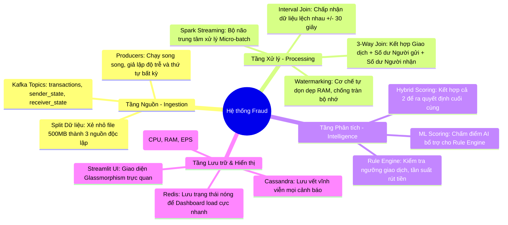

# 🛡️ Real-time Fraud Detection Pipeline: The Ultimate Knowledge Base

[](https://spark.apache.org/)
[](https://kafka.apache.org/)
[](https://cassandra.apache.org/)

Hệ thống này không chỉ là một tập hợp các Script, nó là một giải pháp kiến trúc giải quyết bài toán **"Tin cậy trong dữ liệu lớn"**. Dưới đây là bản đồ tư duy và hướng dẫn chuyên sâu cho toàn bộ Pipeline.

---

## 🧠 1. Bản Đồ Tư Duy Hệ Thống (System Mindmap)



---

## 🏗️ 2. Giải Thích Ý Nghĩa Các Thành Phần (The "Why")

### 📡 2.1. Apache Kafka: Hệ thần kinh trung ương
- **Ý nghĩa:** Trong Big Data, dữ liệu đến từ hàng nghìn nguồn. Kafka đóng vai trò là "vùng đệm". 
- **Tại sao dùng nó?** Nếu Spark bị sập hoặc bảo trì, Kafka sẽ giữ lại dữ liệu. Khi Spark sống lại, nó sẽ đọc tiếp từ vị trí cũ (Checkpoint), không bị mất bất kỳ giao dịch nào.

### 🧠 2.2. Apache Spark: Bộ não phân tích
- **Ý nghĩa:** Xử lý hàng triệu bản ghi mỗi giây (Low Latency). 
- **Cơ chế Watermarking:** Đây là chìa khóa. Trong thực tế, mạng có thể bị lag, dữ liệu đến muộn. Watermark nói với Spark rằng: "Hãy đợi dữ liệu này 10 phút, nếu sau 10 phút nó không đến thì mới bỏ qua". Điều này đảm bảo tính chính xác tuyệt đối.

### 🗄️ 2.3. Cassandra & Redis: Bộ nhớ dài hạn và ngắn hạn
- **Cassandra (Long-term):** Giống như một cuốn sổ cái khổng lồ. Dùng để lưu vết gian lận phục vụ việc tra soát sau này. Nó cực mạnh khi cần ghi dữ liệu liên tục (High Write Throughput).
- **Redis (Short-term):** Giống như bộ nhớ đệm. Dùng để Dashboard hiển thị ngay lập tức. Nếu Dashboard truy vấn thẳng vào Cassandra hàng triệu dòng, nó sẽ bị chậm. Redis giải quyết vấn đề này.

---

## 🌊 3. Giải Thích Logic Tích Hợp (The Integration Logic)

### 3.1. 3-Way Interval Join là gì?
Một giao dịch gian lận chỉ lộ diện khi ta biết:
1. **Giao dịch:** A chuyển cho B 100 triệu.
2. **Trạng thái A:** Trước đó A chỉ có 101 triệu (Rút gần hết).
3. **Trạng thái B:** Tài khoản B vừa mới lập được 2 tiếng.

Hệ thống của chúng ta **Join (Kết nối)** 3 luồng tin nhắn này lại dựa trên thời gian. Chúng ta cho phép chúng lệch nhau 30 giây (`JOIN_TOLERANCE`) để đảm bảo dù tin nhắn nào đến trước, đến sau thì Spark vẫn ghép đúng bộ 3 thông tin này lại.

### 3.2. Hybrid Scoring (Trí tuệ hỗn hợp)
- **Rule Engine (Cứng):** Nếu giao dịch > 500tr -> Cảnh báo ngay.
- **ML Score (Mềm):** AI dự đoán xác suất gian lận dựa trên hành vi.
- **Kết quả:** Trên Dashboard bạn sẽ thấy cả 2 con số này để người vận hành (Analyst) có cái nhìn đa chiều nhất.

---

## 🚀 4. Hướng Dẫn Vận Hành Chi Tiết (Detailed Operations)

### Bước 1: Khởi động hệ thống
```powershell
docker-compose up -d
```
> **Giải thích:** Lệnh này dựng lên toàn bộ "thành phố" Big Data (Kafka, Cassandra, Spark, Redis, Grafana).

### Bước 2: Chia tách dữ liệu (Data Preparation)
```powershell
python scripts/split_logical_sources.py --csv-path "Data\archive (2)\PS_20174392719_1491204439457_log.csv" --output-dir "Data\logical_sources"
```
> **Giải thích:** Tệp 500MB là quá lớn để một script đẩy vào Kafka. Chúng ta xẻ nó ra thành 3 tệp nhỏ để mô phỏng 3 hệ thống ngân hàng độc lập.

### Bước 3: Cấu hình hạ tầng (Bootstrap)
```powershell
python scripts/bootstrap_local_stack.py
```
> **Giải thích:** Tạo bảng trong Cassandra và nạp 3 quy tắc rủi ro mẫu vào Kafka.

### Bước 4: Bơm dữ liệu toàn phần (Ingestion)
```powershell
python scripts/publish_logical_sources_parallel.py --rate 100
```
- **--rate 100:** Đẩy 100 giao dịch/giây. Bạn có thể tăng lên 500 nếu máy mạnh.
- **Ý nghĩa:** Bạn sẽ thấy Log nhảy liên tục, đây là lúc dữ liệu thực sự "chảy" qua Pipeline.

---

## 🕵️ 5. Giám Sát & Quan Sát (Observability)

1. **Dashboard Doanh nghiệp (Streamlit):** `http://localhost:8501`
   - Quan sát các dòng **🔴 CRITICAL**. 
   - Ý nghĩa: Đây là kết quả cuối cùng của toàn bộ Pipeline.

2. **Dashboard Kỹ thuật (Grafana):** `http://localhost:3001`
   - Quan sát **EPS (Events Per Second)**: Nếu EPS > 0 nghĩa là Spark đang làm việc.
   - Quan sát **CPU/RAM**: Nếu CPU quá 80%, bạn nên giảm `--rate` ở Bước 4.

---
*Bản tài liệu này là tài sản trí tuệ của dự án Big Data Fraud Detection v4.*
