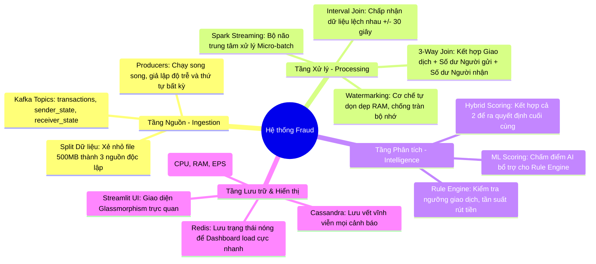
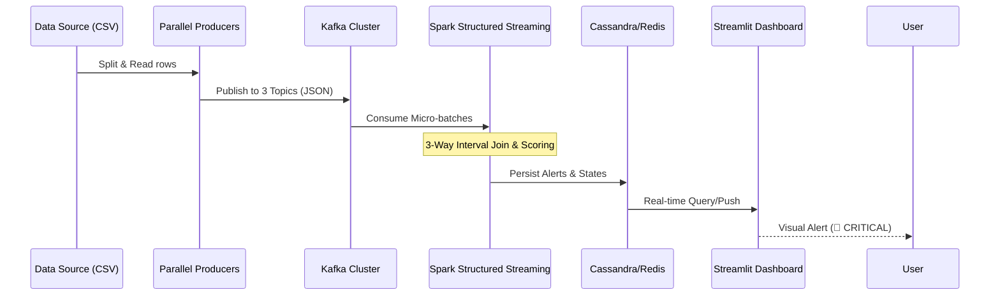
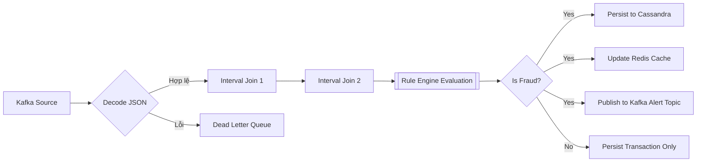
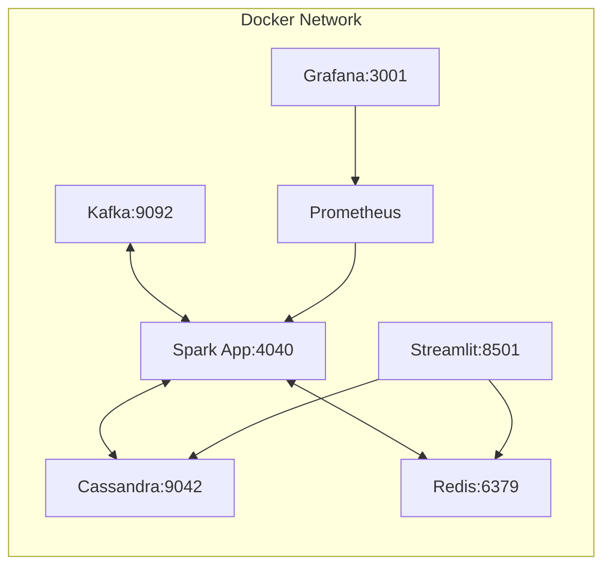

# 🛡️ Real-time Fraud Detection Pipeline: Technical Deep Dive

[](https://spark.apache.org/)
[](https://kafka.apache.org/)
[](https://cassandra.apache.org/)

Tài liệu này cung cấp cái nhìn chi tiết về cấu trúc thượng tầng và logic nội tại của hệ thống phát hiện gian lận real-time.

---

## 📚 0. Thuật Ngữ Cho Người Mới (Glossary)

Nếu bạn là sinh viên mới bắt đầu, hãy đọc phần này trước:
- **Streaming (Dòng dữ liệu):** Dữ liệu chảy liên tục như vòi nước, không dừng lại (khác với Batch là dữ liệu tĩnh trong file).
- **Kafka:** Giống như một cái tủ bưu điện. Người gửi bỏ thư vào, người nhận lấy thư ra. Giúp các hệ thống không cần chờ đợi nhau.
- **Spark:** Một cỗ máy tính toán cực nhanh, có thể xử lý hàng triệu phép tính mỗi giây.
- **Join:** Phép nối các bảng dữ liệu lại với nhau (như trong SQL) nhưng thực hiện trên dữ liệu đang chảy.
- **Latency (Độ trễ):** Thời gian từ lúc giao dịch xảy ra đến lúc hiện cảnh báo. Mục tiêu của chúng ta là càng nhỏ càng tốt (< 2 giây).

---

## 🧠 1. Bản Đồ Tư Duy Hệ Thống (System Mindmap)



---

## 🏗️ 2. Hành Trình Của Dữ Liệu (Data Life Cycle)

Sơ đồ dưới đây mô tả cách một giao dịch được xử lý qua các tầng từ lúc phát sinh đến khi được cảnh báo:



## 🏗️ 2. Kiến Trúc Hệ Thống Chi Tiết (Architecture Deep Dive)

Hệ thống được thiết kế theo mô hình **Lambda-like Architecture** thu nhỏ, tập trung hoàn toàn vào lớp **Speed Layer** để đảm bảo thời gian phản hồi gần như tức thì.

### 2.1. Tầng Ingestion (Dẫn nạp)
- **Logic:** Sử dụng `publish_logical_sources_parallel.py` để đẩy dữ liệu vào 3 Topics Kafka độc lập.
- **Ý nghĩa:** Việc tách biệt 3 nguồn dữ liệu (Giao dịch, Trạng thái người gửi, Trạng thái người nhận) giúp hệ thống mô phỏng đúng môi trường thực tế ngân hàng - nơi các thông tin này thường nằm ở các DB khác nhau.

### 2.2. Tầng Processing (Xử lý tập trung)
- **Spark Structured Streaming:** Sử dụng cơ chế `Checkpointing` để đảm bảo tính **Exactly-once semantics**. Nếu hệ thống sập, nó sẽ phục hồi đúng bản ghi đang xử lý dở.
- **Interval Join:** Đây là kỹ thuật khó nhất. Spark sẽ duy trì một "cửa sổ thời gian" trong RAM để đợi các mảnh ghép của một giao dịch đến đủ từ 3 phía trước khi đưa ra quyết định.

### 2.3. Tầng Serving (Lưu trữ & Phục vụ)
- **Hybrid Storage:** 
    - **Cassandra:** Lưu trữ dạng **Time-series**. Cực kỳ tối ưu cho việc truy vấn lịch sử cảnh báo theo thời gian của một tài khoản.
    - **Redis:** Lưu trữ **Key-Value**. Dùng để lưu trạng thái "nóng" (ví dụ: tài khoản X đang bị theo dõi đặc biệt) để Spark truy xuất trong vài mili giây.

---

## ⚙️ 3. Spark Processing: Cơ Chế Tích Hợp & Xử Lý Dữ Liệu

Đây là phần "bộ não" của toàn bộ dự án. Spark thực hiện quy trình 4 giai đoạn trong mỗi Micro-batch:

### 3.1. Quy trình xử lý bên trong Spark



### 3.2. Giải mã & Làm sạch (Decode & Cleanse)
Spark đọc dữ liệu thô từ Kafka dưới dạng JSON. Sử dụng hàm `decode_json_stream` để:
- Áp dụng Schema tĩnh (`transaction_schema`, `sender_state_schema`).
- Kiểm tra tính hợp lệ (Data Quality): Lọc bỏ các bản ghi có số tiền âm hoặc thiếu ID. Các bản ghi lỗi được đẩy vào **Dead Letter Queue (DLQ)**.

### 3.2. Tích hợp 3 Luồng (3-Way Stream Integration)
Thuật toán `build_integrated_stream` thực hiện phép nối chuỗi:
1.  `Transactions` JOIN `Sender_State` trên `event_id` với khoảng thời gian +/- 30 giây.
2.  Kết quả trên tiếp tục JOIN với `Receiver_State`.
- **Tại sao dùng Interval Join?** Vì trong hệ thống phân tán, tin nhắn về số dư người nhận có thể đến Kafka chậm hơn tin nhắn giao dịch. Interval Join cho phép Spark "chờ" bản ghi đó trong một khoảng thời gian nhất định mà không làm tắc nghẽn luồng xử lý.

### 3.3. Chấm điểm rủi ro (Scoring Logic)
Sau khi có bức tranh đầy đủ về giao dịch, Spark gọi `RuleEngine`:
- **Rule-based:** Kiểm tra các ngưỡng (Threshold) như: Chuyển tiền vượt hạn mức, rút tiền liên tục trong thời gian ngắn (Velocity check).
- **ML-based:** Sử dụng Model để dự đoán xác suất gian lận. Kết quả là một điểm số rủi ro từ 0 đến 1.

### 3.4. Ghi dữ liệu song song (Sinks)
Sử dụng `foreachBatch` để thực hiện ghi đa mục tiêu:
- Ghi vào **Cassandra** để lưu trữ lâu dài.
- Ghi vào **Redis** để phục vụ Dashboard.
- Đẩy Alert mới vào **Kafka Topic `fraud_alerts`** để các hệ thống khác (ví dụ: hệ thống khóa thẻ tự động) có thể tiêu thụ.

---

## 📦 4. Chi Tiết Các Module Trong Pipeline

Hệ thống được module hóa để dễ dàng bảo trì và mở rộng:

### 4.1. `fraud_pipeline` (Lõi logic)
- `models.py`: Định nghĩa các thực thể dữ liệu (Transaction, AccountState, FraudDecision).
- `rules.py`: Chứa các quy tắc phát hiện gian lận (HighAmountRule, RapidOutflowRule).
- `serialization.py`: Chuyển đổi dữ liệu giữa các định dạng (Dict, JSON, Object).

### 4.2. `spark-app` (Thực thi Streaming)
- `stream_job.py`: Script chính điều khiển toàn bộ Pipeline. Thiết lập các truy vấn streaming, định nghĩa Watermarks và kết nối các Sinks.
- `Dockerfile`: Đóng gói môi trường Spark, Python và các Driver cần thiết (Kafka, Cassandra, Redis).

### 4.3. `dashboard` (Hiển thị)
- `app.py`: Ứng dụng Streamlit sử dụng phong cách **Glassmorphism**. Nó truy vấn trực tiếp Cassandra/Redis để hiển thị các "điểm nóng" gian lận với hiệu ứng màu sắc (Đỏ: Nguy hiểm, Cam: Cảnh báo).

### 4.4. `scripts` (Tiện ích & Vận hành)
- `bootstrap_local_stack.py`: Tự động hóa việc tạo Table, nạp Rule ban đầu.
- `publish_logical_sources_parallel.py`: Producer hiệu năng cao, chạy đa luồng để bơm dữ liệu vào Kafka.

### 4.5. Sơ đồ hạ tầng Docker (Deployment)



---

## 🚀 5. Hướng Dẫn Cài Đặt Cho Sinh Viên

> [!CAUTION]
> **Yêu cầu phần cứng:** Máy tính cần tối thiểu **8GB RAM** (Khuyến nghị 16GB). Hãy tắt các ứng dụng nặng khác trước khi chạy.

### Bước 1: Chuẩn bị
1. Cài đặt **Docker Desktop** (Dùng để chạy các phần mềm nặng mà không cần cài trực tiếp vào máy).
2. Cài đặt **Python 3.9+**.

### Bước 2: Khởi động hệ thống
```powershell
docker-compose up -d
```
*Giải thích: Lệnh này sẽ tự động tải và chạy Kafka, Spark, Cassandra, Redis. Đợi khoảng 2-3 phút cho đến khi tất cả các biểu tượng trong Docker Desktop hiện màu xanh.*

### Bước 3: Nạp dữ liệu & Luật
```powershell
python scripts/bootstrap_local_stack.py
```
*Giải thích: Tạo ra các "ngăn chứa" dữ liệu trong Database và nạp các luật bắt gian lận mẫu.*

### Bước 4: Chạy Dashboard & Xem kết quả
- Mở trình duyệt vào `http://localhost:8501` (Dashboard Streamlit).
- Chạy script bơm dữ liệu: `python scripts/publish_logical_sources_parallel.py --rate 10`.

---

## 🛠️ 6. Bắt Bệnh Hệ Thống (Troubleshooting)

| Lỗi thường gặp | Cách xử lý |
| :--- | :--- |
| **Máy bị treo, đứng hình** | Giảm tham số `--rate` xuống còn 1 hoặc 2. |
| **No data trên Grafana** | Đảm bảo Spark đang chạy bằng lệnh `docker logs -f spark-fraud-detection`. |
| **Lỗi Connection Refused** | Đợi thêm 1 phút để các Database khởi động xong hoàn toàn. |

---

## 🎓 7. Thử Thách Cho Bạn (Learning Challenges)

Để hiểu sâu hơn, bạn hãy thử tự mình thực hiện các bài tập sau:
1. **Thay đổi luật:** Mở file `fraud_pipeline/rules.py`, thử tăng ngưỡng `HighAmountRule` lên và xem Dashboard có bớt cảnh báo đi không.
2. **Đổi màu giao diện:** Mở `dashboard/streamlit/app.py` và thử thay đổi màu sắc của các dòng cảnh báo.
3. **Thêm Metrics:** Thử tìm cách hiển thị thêm tổng số tiền gian lận đã phát hiện lên Grafana.

---
*Tài liệu này được soạn thảo bởi Antigravity AI dành cho dự án Real-time Fraud Detection v4.*
