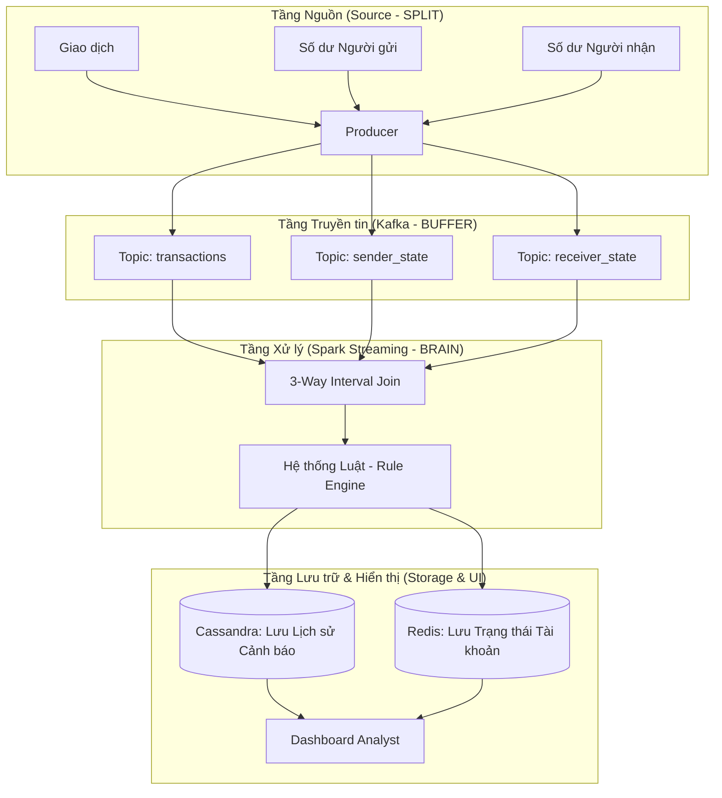

# 🛡️ CẨM NANG ONBOARDING: HỆ THỐNG PHÁT HIỆN GIAN LẬN REAL-TIME

Chào mừng bạn đến với đội ngũ kỹ sư Big Data! Tài liệu này là "tấm bản đồ" giúp bạn làm chủ hệ thống phát hiện gian lận tài chính triệu đô chỉ trong vòng 30 phút.

---

## 🏛️ PHẦN 1: TƯ DUY HỆ THỐNG (ARCHITECTURE)

Trước khi gõ lệnh, bạn cần hiểu dữ liệu "chảy" như thế nào. Hệ thống của chúng ta được xây dựng trên triết lý **"Chia để trị" (Split then Integrate)**.

### 1.1. Sơ đồ dòng chảy dữ liệu


### 1.2. Tại sao lại chọn những công nghệ này?
-   **Kafka:** Giống như một "hộp thư" khổng lồ, giúp các hệ thống khác nhau nói chuyện mà không cần chờ đợi nhau.
-   **Spark Streaming:** Là "bộ não" có khả năng xử lý hàng tỷ bản ghi. Nó có thể kết nối 3 luồng dữ liệu rời rạc thành 1 bức tranh tổng thể (Integration).
-   **Cassandra:** Một kho chứa "không đáy", cực mạnh khi cần ghi dữ liệu liên tục.
-   **Redis:** Một bộ nhớ siêu tốc (RAM), giúp Dashboard hiển thị kết quả trong chớp mắt.

---

## 🚀 PHẦN 2: HƯỚNG DẪN TRIỂN KHAI (STEP-BY-STEP)

Hãy thực hiện chính xác 5 bước sau để kích hoạt hệ thống:

### Bước 1: Chuẩn bị môi trường
1.  Mở **Docker Desktop**.
2.  **Quan trọng:** Vào Settings > Resources, tăng RAM lên ít nhất **8GB**. Hệ thống Big Data rất "ngốn" tài nguyên.

### Bước 2: Kích hoạt hạ tầng
Mở Terminal tại thư mục dự án và chạy:
```powershell
docker-compose up -d
```
*Đợi khoảng 2 phút để Cassandra và Kafka "thức dậy" hoàn toàn.*

### Bước 3: Dựng "Nhà" cho dữ liệu (Bootstrap)
Chạy script để tạo bảng và nạp các quy tắc rủi ro:
```powershell
python scripts/bootstrap_local_stack.py
```

### Bước 4: Đẩy dữ liệu giả lập (Ingestion)
Mở một Terminal mới để bắt đầu bơm dữ liệu vào hệ thống:
```powershell
# Đẩy 20 giao dịch mỗi giây
python scripts/publish_logical_sources_parallel.py --rate 20 --max-events 5000
```

### Bước 5: Thưởng thức thành quả (Dashboards)
1.  **Dashboard Chuyên gia (Streamlit):** Truy cập `http://localhost:8501`. Đây là nơi bạn thấy các cảnh báo gian lận hiện ra theo thời gian thực.
2.  **Dashboard Kỹ thuật (Grafana):** Truy cập `http://localhost:3001` (admin/admin). Xem biểu đồ **Throughput (EPS)** để biết hệ thống đang xử lý bao nhiêu giao dịch/giây.

---

## 🛠️ PHẦN 3: KỸ NĂNG XỬ LÝ SỰ CỐ (TROUBLESHOOTING)

Là một kỹ sư, bạn không sợ lỗi, bạn chỉ cần biết cách sửa:

| Lỗi thường gặp | Nguyên nhân | Cách xử lý |
| :--- | :--- | :--- |
| **AnalysisException: Redefining watermark** | Xung đột dữ liệu cũ trong Checkpoint | Chạy: `Remove-Item -Recurse -Force ./spark_checkpoints/*` |
| **Cassandra Connection Refused** | Cassandra chưa khởi động xong | Đợi 1 phút hoặc kiểm tra cột Status trong Docker hiện "Healthy" |
| **Grafana: No data** | Spark chưa đẩy metrics hoặc chưa có dữ liệu chạy | Đảm bảo script ở Bước 4 đang chạy và Spark Job không báo lỗi |
| **Máy bị treo, giật lag** | Docker chiếm quá nhiều CPU/RAM | Giảm `--rate` ở Bước 4 xuống còn 5 hoặc tăng RAM cho Docker |

---

## 🎓 PHẦN 4: THUẬT NGỮ CẦN NHỚ (GLOSSARY)

1.  **Topic:** Một "kênh" truyền tin trong Kafka.
2.  **Watermark:** Mốc thời gian để Spark quyết định khi nào nên bỏ qua những dữ liệu đến quá muộn.
3.  **Checkpoint:** "Điểm lưu game", giúp Spark có thể chạy tiếp từ nơi nó vừa dừng lại nếu gặp sự cố.
4.  **Interval Join:** Phép nối dữ liệu dựa trên một khoảng thời gian (ví dụ: tìm số dư trong khoảng +/- 30 giây so với lúc giao dịch).

---

## 🏆 THỬ THÁCH ĐẦU TIÊN (YOUR MISSION)
Hãy thử mở file `fraud_pipeline/rules.py` và thay đổi ngưỡng rủi ro của quy tắc `HighAmountRule` từ `0.9` xuống `0.5`. Sau đó restart Spark và xem Dashboard có nhiều cảnh báo hơn không nhé!

*Chúc bạn có một hành trình học tập tuyệt vời tại Team Big Data!*
